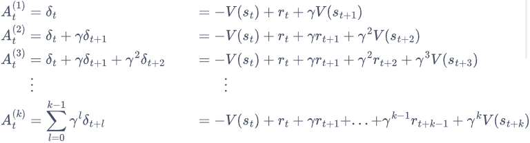
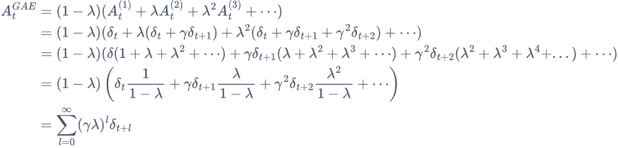
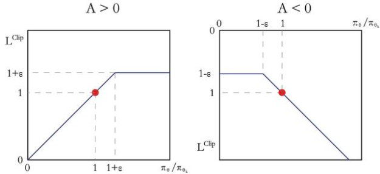

# PPO

## 策略梯度(Policy Gradient)

Objective function:
$$
J(\theta)=\mathbb{E}_{s_0}[V^{\pi_{\theta}}(s_0)]
$$
用状态访问分布$\nu^{\pi}$表示策略梯度：
$$
\begin{align*}
\nabla_{\theta}J(\theta) &\propto \sum_{s\in S}\nu^{\pi_{\theta}}(s) \sum_{a \in A}Q^{\pi_{\theta}}(s,a) \nabla_{\theta}\pi_{\theta}(a|s) \\

&=\mathbb{E}_{\pi_{\theta}}[Q^{\pi_{\theta}}(s,a)\nabla_{\theta} \log\pi_{\theta}(a|s)]
\end{align*}
$$

更一般的表达式：
$$
g = \mathbb{E}[\sum_{t=0}^T\psi_t\nabla_{\theta}\log\pi_{\theta}(a|s)]
$$

其中，$\psi_t$有多种形式：

$$
\begin{align*}

&1. \sum_{t'=0}^T \gamma^{t'} r_{t'}: \text{轨迹的总回报；} \\
&2. \sum_{t'=t}^T \gamma^{t' - t} r_{t'}: \text{动作 } a_t \leq f_t = \text{回报；} \\
&3. \sum_{t'=t}^T \gamma^{t' - t} r_{t'} - b(s_t): \text{基准线版本的改进；} \\
&4. Q^{T_0}(s_t, a_t): \text{动作价值函数；} \\
&5. A^{T_0}(s_t, a_t): \text{优势函数；} \\
&6. r_t + \gamma V^{T_0}(s_{t+1}) - V^{T_0}(s_t): \text{时序差分残差。}
   \end{align*}
$$

## REINFORCE

$$
\begin{align*}
\nabla_{\theta} J(\mathbf{\theta}) = \mathbb{E}_{\pi_{\theta}} \left[ \sum_{t=0}^{T} \left( \sum_{t'=t}^{T} \gamma^{t'-t} r_{t'} \right) \nabla_{\theta} \log \pi_{\theta} (a_t | s_t) \right]
\end{align*}
$$


## Actor-Critic

REINFORCE 算法基于蒙特卡洛采样，只能在序列结束后进行更新，这同时也要求任务具有有限的步数，而 Actor-Critic 算法则可以在每一步之后都进行更新，并且不对任务的步数做限制。

时序差分残差：
$$
\psi_t=r_t+\gamma V^{\pi_{\theta}}(s_{t+1})-V^{\pi_{\theta}}(s_{t})
$$

- Actor 要做的是与环境交互，并在 Critic 价值函数的指导下用策略梯度学习一个更好的策略。
- Critic 要做的是通过 Actor 与环境交互收集的数据学习一个价值函数，这个价值函数会用于判断在当前状态什么动作是好的，什么动作不是好的，进而帮助 Actor 进行策略更新。


### Actor更新函数

Actor的策略为：
$$
\begin{align*}
J(\mathbf{\theta}) = \mathbb{E}_{\pi_{\theta}} \left[ \sum_{t=0}^{T} (r_t+\gamma V^{\pi_{\theta}}(s_{t+1})-V^{\pi_{\theta}}(s_{t})) \log \pi_{\theta} (a_t | s_t) \right]
\end{align*}
$$
与之对应的代码为：


```python
td_target = rewards + self.gamma * self.critic(next_states) * (1 - dones)
td_delta = td_target - self.critic(states)  # 时序差分误差
log_probs = torch.log(self.actor(states).gather(1, actions))
actor_loss = torch.mean(-log_probs * td_delta.detach())
```

**Note:** torch.mean()操作包含了对一个batch内的所有样本求和以及每个样本内的所有时间步求和，如下公式所示，用样本平均替代$\mathbb{E}$。
$$
\begin{align*}
g = \frac{1}{B} \sum_{b=1}^{B} \mathbb{E} [ \sum_{t=0}^{T} \psi_t^{(b)} \nabla_{\theta} \log \pi_{\theta} (a_t^{(b)} | s_t^{(b)} ) ]
\end{align*}
$$

Actor的策略梯度公式为：
$$
\begin{align*}
\nabla_{\theta} J(\mathbf{\theta}) = \mathbb{E}_{\pi_{\theta}} \left[ \sum_{t=0}^{T} (r_t+\gamma V^{\pi_{\theta}}(s_{t+1})-V^{\pi_{\theta}}(s_{t})) \nabla_{\theta} \log \pi_{\theta} (a_t | s_t) \right]
\end{align*}
$$
与之对应的代码是：

```python
actor_loss.backward()  # 计算策略网络的梯度
```


### Critic更新函数

将 Critic 价值网络表示为$V_{\omega}$，参数为$\omega$。于是，我们可以采取时序差分残差的学习方式:
$$
\mathcal{L}(\omega)=\frac12(r+\gamma V_{\omega}(s_{t+1})-V_{\omega}(s_{t}))^2
$$

与公式对应的代码：


```python
# 均方误差损失函数
critic_loss = F.mse_loss(self.critic(states), td_target.detach())
```

从而Critic的梯度为：
$$
\nabla_{\omega}\mathcal{L}(\omega)=(r+\gamma V_{\omega}(s_{t+1})-V_{\omega}(s_{t})) \nabla_{\omega}V_{\omega}
$$
与公式对应的代码：

```python
critic_loss.backward()  # 计算价值网络的梯度
```


## TRPO

由于初始状态$s_0$的分布和策略$\pi_{\theta}$无关，因此策略下的优化目标$J(\theta)$可以写成在新策略的期望形式：
$$
\begin{align*}
J(\theta) &= \mathbb{E}_{s_0} [V^{\pi_{\theta}}(s_0)]\\
&=\mathbb{E}_{\pi_{\theta}'}[\sum_{t=0}^{\infty}\gamma^t V^{\pi_{\theta}}(s_t) - \sum_{t=1}^{\infty}\gamma^t V^{\pi_{\theta}}(s_t)]\\
&=\mathbb{E}_{\pi_{\theta}'}[\sum_{t=0}^{\infty}\gamma^t(\gamma V^{\pi_{\theta}}(s_{t+1})-V^{\pi_{\theta}}(s_t))]
\end{align*}
$$
定义优势函数$A$:
$$
A^{\pi_{\theta}}(s_t,a_t)=r(s_t, a_t) + \gamma V^{\pi_{\theta}}(s_{t+1}) - V^{\pi_{\theta}}(s_t)
$$
新旧策略的目标函数之间的差距：
$$
\begin{align*}
J(\theta')-J(\theta)&=\mathbb{E}_{\pi_{\theta}'}[\sum_{t=0}^{\infty}\gamma^t A^{\pi_{\theta}}(s_t,a_t)]\\
&= \sum_{t=0}^{\infty} \gamma^t \mathbb{E}_{s_t \sim P_t^\pi \rho^t} \mathbb{E}_{a_t \sim \pi \left( \cdot \left| s_t \right| \right)} \left[ A^{\pi _{\theta}}(s_t, a_t) \right] \\
&= \frac{1}{1 - \gamma} \mathbb{E}_{s \sim \nu^\pi } \mathbb{E}_{a \sim \pi_{\theta}' \left( \cdot \left| s \right| \right)} \left[ A^{\pi_{\theta}}(s, a) \right]
\end{align*}
$$
由于直接难以求解，忽略两个策略之间的状态访问分布变化，直接采用旧策略的状态分布，定义替代优化函数：
$$
L_{\theta}(\theta')=J(\theta) +\frac{1}{1 - \gamma} \mathbb{E}_{s \sim \nu^\pi } \mathbb{E}_{a \sim \pi_{\theta}' \left( \cdot \left| s \right| \right)} \left[ A^{\pi_{\theta}}(s, a) \right]
$$
用重要性采样对动作分布做处理：
$$
\begin{align*}
L_{\theta}(\theta') = J(\theta) + \mathbb{E}_{s \sim \nu \pi \theta} \mathbb{E}_{a \sim \pi \theta}( \cdot | s)  \left[ \frac{\pi \theta'(a|s)}{\pi \theta(a|s)} A^{\pi \theta}(s,a) \right]
\end{align*}
$$
因此，采用KL散度作为衡量策略之间的距离，整体优化公式为：
$$
\begin{align*}
&\max_{\theta'} L_{\theta}(\theta') \\

&s.t. \mathbb{E}_{s \sim \nu}^{\pi_{\theta_k}} [D_{KL} (\pi_{\theta_k} (\cdot \mid s), \pi_{\theta}' (\cdot \mid s))] \leq \delta
\end{align*}
$$

### 近似求解

对目标函数和约束在$\theta_k$泰勒展开，分别用1阶和2阶近似：
$$
\begin{align*}
&\mathbb{E}_{s\sim\nu^{\pi_{\theta_{k}}}}\mathbb{E}_{a\sim\pi_{\theta_{k}}(\cdot|s)}\left[\frac{\pi_{\theta^{\prime}}(a|s)}{\pi_{\theta_{k}}(a|s)}A^{\pi_{\theta_{k}}}(s,a)\right]\approx g^{T}(\theta^{\prime}-\theta_{k})\\
&\mathbb{E}_{s\sim\nu^{\pi_{\theta_{k}}}}[D_{KL}(\pi_{\theta_{k}}(\cdot|s),\pi_{\theta^{\prime}}(\cdot|s))]\approx\frac{1}{2}(\theta^{\prime}-\theta_{k})^{T}H(\theta^{\prime}-\theta_{k})
\end{align*}
$$
其中：
$$
\begin{align*}
&g=\nabla_{\theta'}\mathbb{E}_{s\sim\nu^{\pi_{\theta_{k}}}}\mathbb{E}_{a\sim\pi_{\theta_{k}}(\cdot|s)}\left[\frac{\pi_{\theta^{\prime}}(a|s)}{\pi_{\theta_{k}}(a|s)}A^{\pi_{\theta_{k}}}(s,a)\right]\approx g^{T}(\theta^{\prime}-\theta_{k})\\
&H=\mathbb{H}[\mathbb{E}_{s\sim\nu^{\pi_{\theta_{k}}}}[D_{KL}(\pi_{\theta_{k}}(\cdot|s),\pi_{\theta^{\prime}}(\cdot|s))]]
\end{align*}
$$
优化目标改为：
$$
\begin{align*}
&\theta_{k+1} = \arg \max_{\theta'} g^T (\theta' - \theta_k)\\
&\text{s.t.} \quad \frac{1}{2} (\theta' - \theta_k)^T H(\theta' - \theta_k) \leq \delta
\end{align*}
$$
使用KKT条件解得：
$$
\begin{align*}
\theta_{k+1} = \theta_k + \sqrt{\frac{2\delta}{g^T H^{-1} g}} H^{-1} g
\end{align*}
$$
由于求解$H^{-1}$的维度很大，极度消耗计算资源，因此做变换$H^{-1}g=x$，等价于$Hx=g$，而又有：
$$
\begin{align*}
H v &= \nabla_\theta \left( \left( \nabla_{\theta'} D_{\mathrm{KL}}^{\nu^{\pi_{\theta}}}(\pi_{\theta}, \pi_{\theta'}) \right)^T  \right) v\\
&=\nabla_\theta \left( \left( \nabla_{\theta'} D_{\mathrm{KL}}^{\nu^{\pi_{\theta}}}(\pi_{\theta}, \pi_{\theta'}) \right)^T v \right)
\end{align*}
$$
又因为黑塞矩阵**H**是正定矩阵，可以用**共轭梯度法**解得x


### 线性搜索

由于 TRPO 算法用到了泰勒展开的 1 阶和 2 阶近似，这并非精准求解，因此，$\theta'$可能未必比$\theta_k$好，或未必能满足 KL 散度限制。TRPO 在每次迭代的最后进行一次**线性搜索**（Line Search），以确保找到满足条件。**具体来说，就是找到一个最小的非负整数$i$，使得按照**
$$
\theta_{k+1} = \theta_k + \alpha^i \sqrt{\frac{2\delta}{g^T H^{-1} g}} H^{-1} g
$$

### 广义优势估计

目前比较常用的一种方法为**广义优势估计**（Generalized Advantage Estimation，GAE）来估计优势函数：



然后，GAE 将这些不同步数的优势估计进行指数加权平均：



对应的代码：

```python
def compute_advantage(gamma, lmbda, td_delta):
    td_delta = td_delta.detach().numpy()
    advantage_list = []
    advantage = 0.0
    for delta in td_delta[::-1]:
        advantage = gamma * lmbda * advantage + delta
        advantage_list.append(advantage)
    advantage_list.reverse()
    return torch.tensor(advantage_list, dtype=torch.float)
```


## PPO截断

在目标函数中限制更新策略的幅度：
$$
\underset{\theta}{\operatorname*{\mathrm{arg}\operatorname*{max}}}\mathbb{E}_{s\sim\nu}{}^{\pi_{\theta_{k}}}\mathbb{E}_{a\sim\pi_{\theta_{k}}(\cdot|s)}\left[\operatorname*{min}\left(\frac{\pi_{\theta}(a|s)}{\pi_{\theta_{k}}(a|s)}A^{\pi_{\theta_{k}}}(s,a),\operatorname{\mathrm{clip}}\left(\frac{\pi_{\theta}(a|s)}{\pi_{\theta_{k}}(a|s)},1-\epsilon,1+\epsilon\right)A^{\pi_{\theta_{k}}}(s,a)\right)\right]
$$
其中$clip(x,l,r)= max(min(x,r),l)$，把x限制在[l,r]范围内。$\pi_{\theta_k}(a|s)$中的$k$是第k次迭代参数$\theta$，当更新完epochs后$k \to k+1$


如果$A^{\pi_{\theta_k}}(s,a)>0$,说明这个动作的价值高于平均，最大化这个式子会增大$\frac{\pi_{\theta}(a|s)}{\pi_{\theta_{k}}(a|s)}$,但不会让其超过$1+\epsilon$。反之，如果$A^\pi_{\theta_{k}}(s,a)<0$,最大化这个式子会减小$\frac{\pi_{\theta}(a|s)}{\pi_{\theta_{k}}(a|s)}$,但不会让其超过1$-\epsilon$。




**Note：**PPO算法会让智能体回顾最近经历的这一段经验（`transition_dict`），反复思考、总结、改进策略，连续学习 `epochs` 轮，而不是只学一遍就丢掉。定义好广义优势估计（GME）和TD目标后，$\pi_{\theta_k}(a|s)$作为`old_log_probs`参与计算。

```python
old_log_probs = torch.log(self.actor(states).gather(1, actions)).detach()
```

